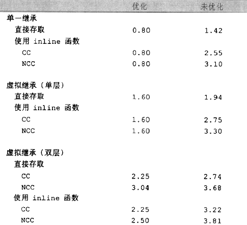

# 3.3
## 以类成员运算符 *"."*和以指针运算符 *"->"*取出成员变量的区别：
```c++
origin.x = 0.0;
pt->x = 0.0;
```
涉及到虚继承，如果origin是涉及到虚继承，则以类成员运算符比以指针运算符取出成员变量的速度快，因为在虚继承中，以指针运算符的结果得直到运行期才决定，而以类成员运算符访问类内成员则在编译期就确定了。


# 3.4 对3.3提出问题的解释

# 3.5 对象成员的存取效率
普通继承与虚继承的存取效率：单一继承>单次虚继承存取效率>多层虚拟继承存储效率。


为了证明书中描述试验，的唯一的方法就是反汇编看数据的存取过程，现用以下的程序证明：
```C++

class Base
{
public:
    int data = 1;
};

class Derive1: public Base
{
public:
    int data = 2; //only -std=c++11 support this specific
};

class Derive2: public virtual Base
{
public:
    int data = 3;
};

class DDerive1_1: public Derive1
{
public:
    int data = 4;
};

class DDerive2_1: public virtual Derive2
{
public:
    int data = 4;
};

int test_inherit_data2()
{
    Base* pbase1;
    Base* pbase2;

    Derive1 derive1;
    Derive2 derive2;
    DDerive2_1 dderive2_1;
    DDerive1_1 dderive1_1;

    
    pbase2 = &derive2;
    pbase1 = &derive1;

    pbase1->data += 10;
    pbase2->data += 10;

    pbase1 = &dderive1_1;
    pbase2 = &dderive2_1;

    pbase1->data += 10;
    pbase2->data += 10;
    return 1;
}

int main(int argc, char const *argv[])
{
    /* code */
    test_inherit_data2();
    return 0;
}

```
编译：
```sh
g++ mult_inherit.cpp -g -m32 -o mult_inherit -std=c++11
```
反汇编并重定向输出：
```sh
objdump -C -S ./mult_inherit >dump_mult_inherit
```
在dump_mult_inherit汇编文件中找出test_inherit_data2()函数的代码片段：
```S
08048a82 <test_inherit_data2()>:
int test_inherit_data2()
{
 8048a82:	55                   	push   %ebp
 8048a83:	89 e5                	mov    %esp,%ebp
 8048a85:	83 ec 48             	sub    $0x48,%esp
 8048a88:	65 a1 14 00 00 00    	mov    %gs:0x14,%eax
 8048a8e:	89 45 f4             	mov    %eax,-0xc(%ebp)
 8048a91:	31 c0                	xor    %eax,%eax
    Base* pbase1;
    Base* pbase2;

    Derive1 derive1;
 8048a93:	c7 45 c0 01 00 00 00 	movl   $0x1,-0x40(%ebp)
 8048a9a:	c7 45 c4 02 00 00 00 	movl   $0x2,-0x3c(%ebp)
    Derive2 derive2;
 8048aa1:	83 ec 0c             	sub    $0xc,%esp
 8048aa4:	8d 45 c8             	lea    -0x38(%ebp),%eax
 8048aa7:	50                   	push   %eax
 8048aa8:	e8 3b 01 00 00       	call   8048be8 <Derive2::Derive2()>
 8048aad:	83 c4 10             	add    $0x10,%esp
    DDerive2_1 dderive2_1;
 8048ab0:	83 ec 0c             	sub    $0xc,%esp
 8048ab3:	8d 45 e0             	lea    -0x20(%ebp),%eax
 8048ab6:	50                   	push   %eax
 8048ab7:	e8 5c 01 00 00       	call   8048c18 <DDerive2_1::DDerive2_1()>
 8048abc:	83 c4 10             	add    $0x10,%esp
    DDerive1_1 dderive1_1;
 8048abf:	c7 45 d4 01 00 00 00 	movl   $0x1,-0x2c(%ebp)
 8048ac6:	c7 45 d8 02 00 00 00 	movl   $0x2,-0x28(%ebp)
 8048acd:	c7 45 dc 04 00 00 00 	movl   $0x4,-0x24(%ebp)

    
    pbase2 = &derive2;
 8048ad4:	8d 45 c8             	lea    -0x38(%ebp),%eax
 8048ad7:	83 c0 08             	add    $0x8,%eax
 8048ada:	89 45 b8             	mov    %eax,-0x48(%ebp)
    pbase1 = &derive1;
 8048add:	8d 45 c0             	lea    -0x40(%ebp),%eax
 8048ae0:	89 45 bc             	mov    %eax,-0x44(%ebp)

    pbase1->data += 10;
 8048ae3:	8b 45 bc             	mov    -0x44(%ebp),%eax
 8048ae6:	8b 00                	mov    (%eax),%eax
 8048ae8:	8d 50 0a             	lea    0xa(%eax),%edx
 8048aeb:	8b 45 bc             	mov    -0x44(%ebp),%eax
 8048aee:	89 10                	mov    %edx,(%eax)
    pbase2->data += 10;
 8048af0:	8b 45 b8             	mov    -0x48(%ebp),%eax
 8048af3:	8b 00                	mov    (%eax),%eax
 8048af5:	8d 50 0a             	lea    0xa(%eax),%edx
 8048af8:	8b 45 b8             	mov    -0x48(%ebp),%eax
 8048afb:	89 10                	mov    %edx,(%eax)

    pbase1 = &dderive1_1;
 8048afd:	8d 45 d4             	lea    -0x2c(%ebp),%eax
 8048b00:	89 45 bc             	mov    %eax,-0x44(%ebp)
    pbase2 = &dderive2_1;
 8048b03:	8d 45 e0             	lea    -0x20(%ebp),%eax
 8048b06:	83 c0 10             	add    $0x10,%eax
 8048b09:	89 45 b8             	mov    %eax,-0x48(%ebp)

    pbase1->data += 10;
 8048b0c:	8b 45 bc             	mov    -0x44(%ebp),%eax
 8048b0f:	8b 00                	mov    (%eax),%eax
 8048b11:	8d 50 0a             	lea    0xa(%eax),%edx
 8048b14:	8b 45 bc             	mov    -0x44(%ebp),%eax
 8048b17:	89 10                	mov    %edx,(%eax)
    pbase2->data += 10;
 8048b19:	8b 45 b8             	mov    -0x48(%ebp),%eax
 8048b1c:	8b 00                	mov    (%eax),%eax
 8048b1e:	8d 50 0a             	lea    0xa(%eax),%edx
 8048b21:	8b 45 b8             	mov    -0x48(%ebp),%eax
 8048b24:	89 10                	mov    %edx,(%eax)
    return 1;
 8048b26:	b8 01 00 00 00       	mov    $0x1,%eax
}
```
其中，影响的过程主要有以下：
```S
    pbase2 = &derive2;
 8048ad4:	8d 45 c8             	lea    -0x38(%ebp),%eax
 8048ad7:	83 c0 08             	add    $0x8,%eax
 8048ada:	89 45 b8             	mov    %eax,-0x48(%ebp)
    pbase1 = &derive1;
 8048add:	8d 45 c0             	lea    -0x40(%ebp),%eax
 8048ae0:	89 45 bc             	mov    %eax,-0x44(%ebp)
```
还有
```S
    pbase1 = &dderive1_1;
 8048afd:	8d 45 d4             	lea    -0x2c(%ebp),%eax
 8048b00:	89 45 bc             	mov    %eax,-0x44(%ebp)
    pbase2 = &dderive2_1;
 8048b03:	8d 45 e0             	lea    -0x20(%ebp),%eax
 8048b06:	83 c0 10             	add    $0x10,%eax
 8048b09:	89 45 b8             	mov    %eax,-0x48(%ebp)
```
类Derive2和DDerive2_1都虚继承与Base，类Derive1和DDerive1_1都从Base类直接继承过来，在上面的代码片段中可以发现，在基类指针指向不同继承类型的子类时，汇编出来的过程不一样，具体的不一样在于基类指针指向虚继承子类时比指向普通继承子类还要多一个汇编指令“add    $num,%eax”，由此可以证明虚继承子类的对象数据取值是不比直接继承快。但是这个多重虚继承的子类比单一虚继承的子类数据存取的速度没有比较，它们都一样；另外汇编指令“add    $num,%eax”用于做什么，这个还需要研究下。<br>
实际上可以通过积累时间的方式来说明虚继承数据存取的速度差别，但这样还没有能够充分研究虚继承的数据存取效率的问题，测试方法还需要寻找。

# 3.6 对象成员的偏置（指向member的指针）
假设有以下类及其派生：
```C++
class Base
{
public:
    int data = 1;
};

class Base2
{
public:
    int data2 = 11;
};

class DDerive: public Base, public Base2
{
public:
};

```
在声明类的成员量可以这么声明：
```C++
int DDerive::* tmp; 
```
DDerive::*DDerive data member的指针类型，是一个偏置，那么这有什么作用呢？其实也没什么卵用，就是指明该成员的偏置，提供c成员索引一种方法：
```C++
int DDerive::* tmp = &DDerive::data; //提示指向成员data的偏置
int DDerive::* tmp1 = &DDerive::data2;
```
DDerive的两个父类Base和Base2的成员类型都是int类型，此时tmp指向data，值为0，tmp1指向data2，值为0x4:

```C++
printf("*tmp = 0x%x\n", tmp); //*tmp = 0x0
printf("*tmp1 = 0x%x\n", tmp1); //*tmp1 = 0x4
```
现有如下函数需要指定区别操作DDerive的成员：
```C++
void func1(int DDerive::* tmp, DDerive* pd2) //DDerive::*DDerive data member的指针类型,是一个偏置
{
    pd2->*tmp;
    cout<< "pd2->*tmp = "<< pd2->*tmp<<endl;
}
```
那么，对于tmp和tmp2的值就是指向不同的偏置效果：
```C++
func1(tmp, &dderive); //pd2->*tmp = 1 ,因为Base::data = 1
func1(tmp1, &dderive); //pd2->*tmp = 11 ,因为Base2::data2 = 11
```
如果要提供对象成员的访问，这的确是一种方法，但是，这毕竟效率低，不只是函数调用，而且通过指向类数据成员指针来指定偏置使得汇编时会多一些偏置操作，还不如直接就用普通指针指向该对象成员数据：那样更快<br>
继续试验，可是，当单独打印&DDerive::data和&DDerive::data2就不是这么回事了,以下情况有待探究:
```C++
printf("&DDerive::data = 0x%x\n", &DDerive::data); //&DDerive::data = 0x0
printf("&DDerive::data2 = 0x%x\n", &DDerive::data2); //&DDerive::data2 = 0x0
```
另外，书中讲了一个有趣的试验，在上述func1中期望的第一个参数得到的是“指向DDerive的成员”的指针，但如果传进来的是一个“指向DDerive的父类的成员(如Base和Base2)”的指针，会怎样呢？
```C++
int Base::* btmp = &Base::data;
int Base2::* btmp2 = &Base2::data2;

printf("&Base::data = 0x%x\n", &Base::data);
printf("*btmp = 0x%x\n", btmp);

printf("&Base2::data2 = 0x%x\n", &Base2::data2);
printf("*btmp2 = 0x%x\n", btmp2);

func1(btmp, &dderive);
func1(btmp2, &dderive);

```
结果输出：
```
&Base::data = 0x0
*btmp = 0x0
&Base2::data2 = 0x0
*btmp2 = 0x0
pd2->*tmp = 1
pd2->*tmp = 11
```
哟，还挺智能的，这说明运行时自动把对dderive的偏置计算好了，这怎么实现的，~~布吉岛呀，*btmp2的值明明是0，按道理来说“func1(btmp2, &dderive);”输出应该是dderive中的data的量，或者相反，“func1(btmp, &dderive);”输出的是dderive中的data2的量，书中也是这么描述的，但实际上编译器的处理使得结果与书中的不一致。

