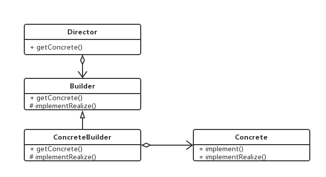
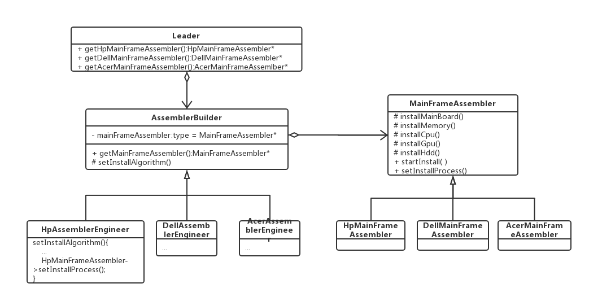
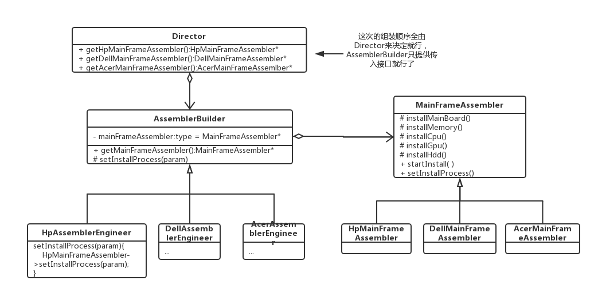

# 建造者模式

### 生产主机的组装机器（简称组装器）的订单

主机包括主板(a)，内存(b)，CPU(c)，显卡(d)，硬盘(e)。不同品牌的主机的组装顺序和组装内容不一样。比如HP组装内容包括a~e，其组装过程是a->b->c->d->e，然而DELL组装内容也包括a~e，但其组装顺序不一样：a->c->e->d->b，还有一些主机是集成显卡和CPU，其组装内容有a，b，e，组装顺序是a->e->b。 

如果HP生产客户需要购买能够生产HP台式主机的组装机器，且不同子系列的组装顺序和内容有可能有变化，从这个需求上来说，组装执行这一功能的需求固定不变（就是要组装），组装方法会改变，这样就需要把产生组装顺序的行为与组装顺序的执行分离开来。

为了分离这一过程，需要一个角色来继续组装顺序的操作，我们把这个能够产生组装器的人称为组装器建造师（AssemblerBuilder），他们会自己按不同厂商主机。调配好主机组装器的动作顺序，然后产生不同的主机组装器。然后根据Leader的要求给出自己的已经调配好了的组装器。然后Leader的提供给客户去生产。而如果Leader是作为Director角色的话,AssemblerBuilder也可以只提供组装接口给Director组装.

就像这种有各种准备好的分立的动作行为（如组装CPU，主板这些行为），然后根据不同需求来各自调用不同的顺序算法的过程,或者说已有调用算法框架,但内部细节实现会被不同需求而改变的情况，都可以将其行为和方法分立，然后不同的顺序算法各自产生一个具体实体，提供给上层获取的实体接口。这样一来，不同组合相对独立，可增可减。其基本的构造UML如下图所示：

其中不同顺序变化就只要增加ConcreteBuilder的构造就行了，然后在Leader里面对应给出Concrete的获取就行。

那么，对于这个主机组装器的实际生产会是怎样的呢？如下图所示：

好了,可以开始编码实现了..

在实现中发现如果这部分装配动作完全由AssemblerBuilder实现的话,如果AssemblerBuilder的使用性只是一时的,比如这次只生产一次HP主机,以后不生产这类主机了,这样的话增加的AssemblerBuilder类最后有可能太多了,太多的话就需要去掉.如果是这样的有"只是临时性"的需求,不如请一个director来收集需求来自己拼接客户所要的流程,那么更改过后的UML如下图所示:

另外的实例可以参考<http://www.runoob.com/design-pattern/builder-pattern.html>

