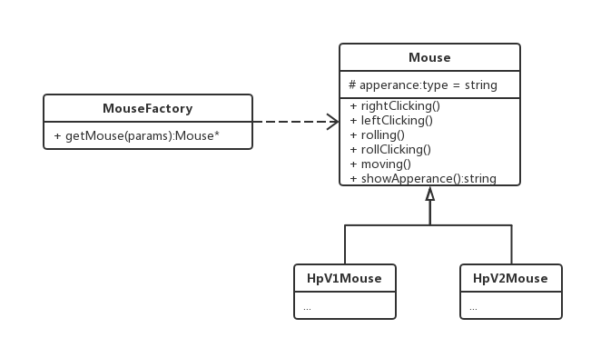
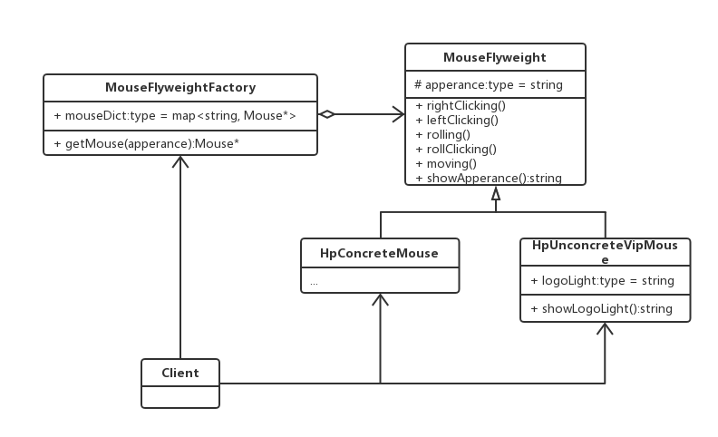

#### 生产鼠标

鼠标的硬件无外乎支持这几种功能:左右键,中间滚轮及其滚轮键,红外光电感应.但是即使同一厂商,其定制的鼠标外壳是不同.生产鼠标类应该是平常的工厂模式,如下图所示:

这样一来, 无论多少种鼠标都可以通过这个鼠标工厂生产了.蛋素,随着HP的产品增多,各类鼠标层出不穷,从V1到Vn版,那应该怎样生产,难道每个硬件底板都要重新开模?要知道,这些鼠标的硬件电路功能一样,并且硬件电路版不占多大的空间,没有必要为了生产多个来重复开模硬件板块.那么,这样一来,只使用一种硬件电路开模就可以提供所有同外观版本的鼠标生产.唯一的区分就是鼠标版次所带来的与之匹配的外观,那么这时候才用多个不同版本的外壳来装配,每有一个版本就有一个外壳,同一版本共用一套硬件.如下图所示:

无论是HpV1Mouse还是HpV2Mouse,其只是外观不同,这可以都归为HpConcreteMouse,在生产时同一个硬件模板可以生成多种不同外观的鼠标,这样看可以实现多个同外观鼠标生产的功能,然而实际上需求总是在变化的,比如,现在有些鼠标卖的很好,有些用户为了区分显示"身份",还多了限量定制版功能,多加了自己定义的发光颜色等.这时候鼠标的基类就不一样了.需要把不共享的功能和共享的功能鼠标做区分.比如分为有特殊发光颜色和没有的,为了实现定制话特殊需求,具体实现情况下图:

